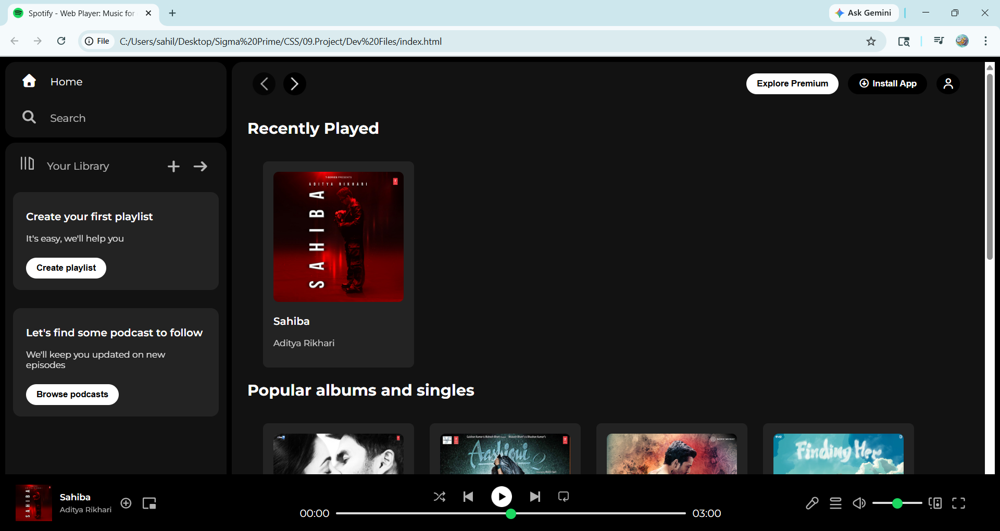
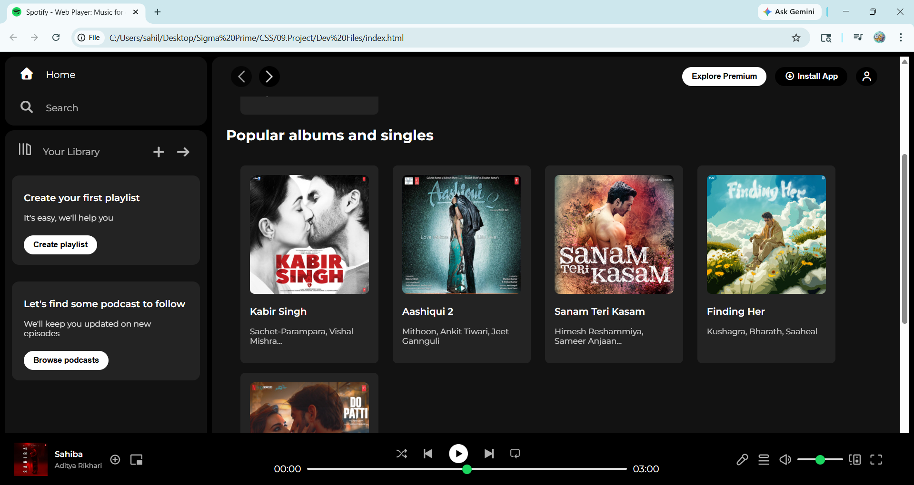
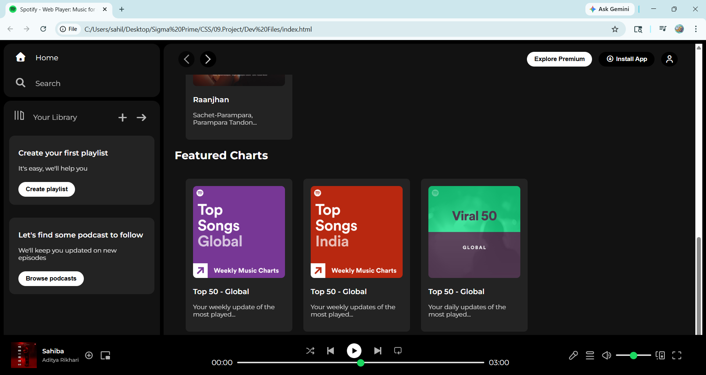

# 🎧 Spotify Web Player Clone (HTML + CSS)

A responsive frontend clone of Spotify's web player built using **pure HTML and CSS**.
This project focuses on layout design, component structuring, and UI consistency without using JavaScript.

---

## 📌 Features

* 🎵 Sidebar navigation (Home, Search, Library)
* 📚 Library section with playlist & podcast cards
* 🧭 Sticky top navigation bar
* 🃏 Reusable card components (albums, charts, playlists)
* 🎧 Fully structured music player:

  * Album section
  * Playback controls
  * Progress bar (custom styled)
  * Volume controls
* 📱 Basic responsive behavior
* 🎨 Clean UI using Flexbox and modern CSS

---

## 🛠️ Tech Stack

* HTML5
* CSS3 (Flexbox, Media Queries, Custom Styling)

---

## 🧠 What I Learned

* Structuring large UI layouts using Flexbox
* Building reusable components (cards, sections)
* Styling complex elements like **range inputs (progress bar)**
* Maintaining UI consistency across sections
* Thinking like a developer instead of just following tutorials

---

## 📂 Project Structure

```
/assets        → images & icons  
index.html     → main structure  
style.css      → styling  
```

---

## 🎯 Future Improvements

* Add JavaScript for real playback functionality
* Improve responsiveness for mobile devices
* Add animations and transitions
* Convert into React components

---

## 📸 Screenshots





---

## 🙌 Acknowledgement

This project was built as part of my frontend learning journey, with additional independent improvements and structuring.

---

## 👤 Author

[**Md Sahil**](https://github.com/CodeWithSahil-alt)
Aspiring Software Developer 🚀

---
